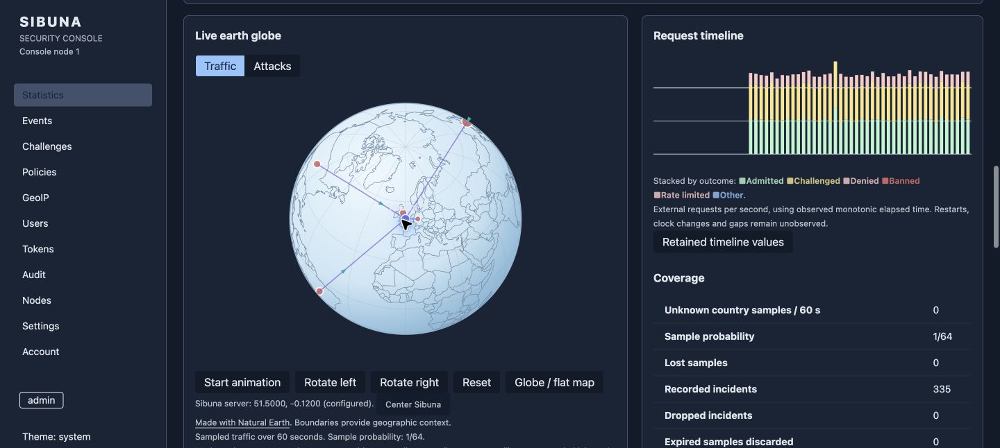
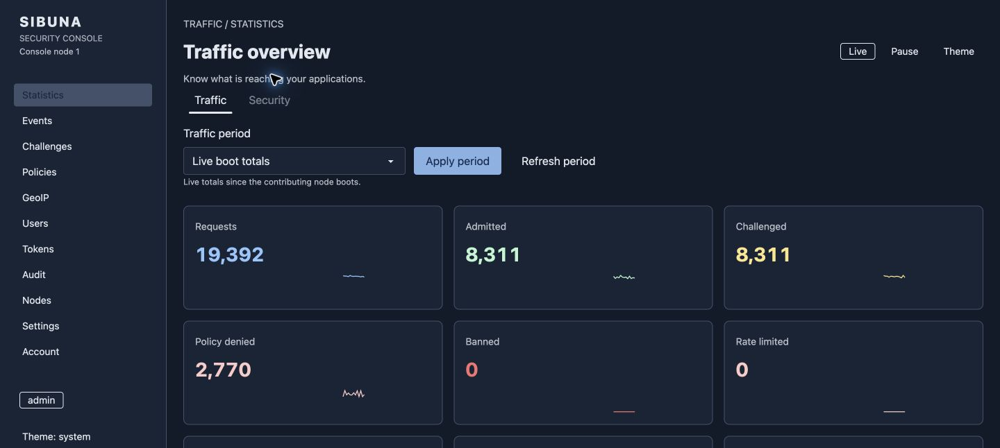
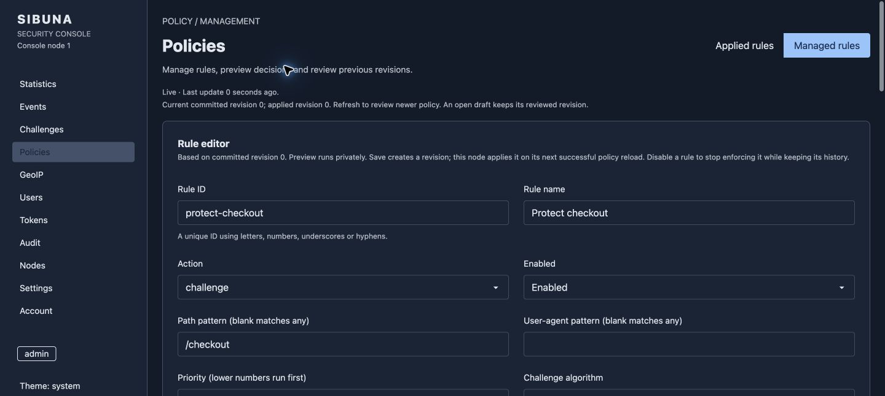
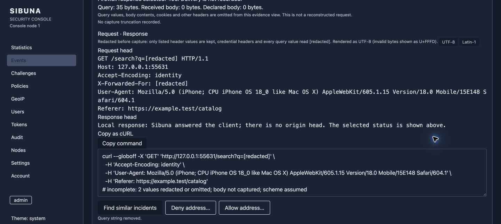
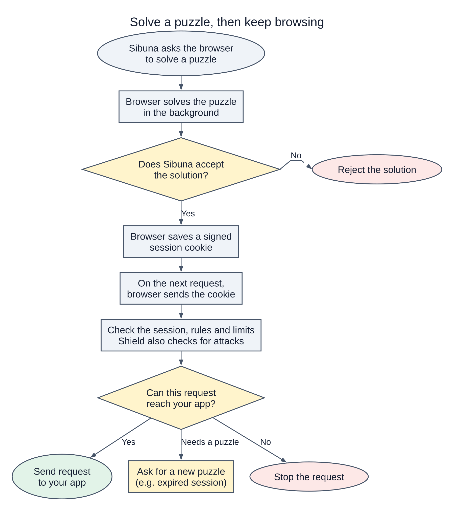
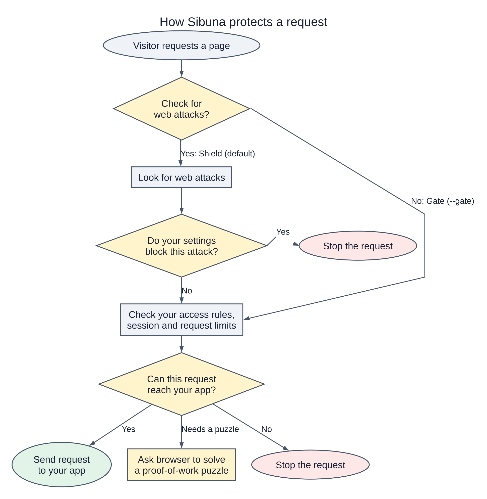
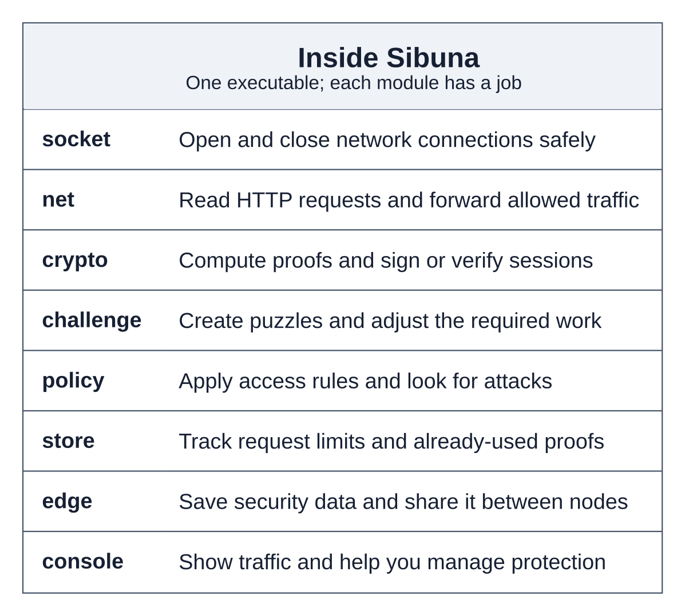

<!-- English source SHA-256: 62c6798d23bbb862a79f760fa8c8937390e9903a501c23d01b52db33b47d4374 -->
<h1 align="center">sibuna</h1>
<p align="center">ブラウザーの計算量証明でウェブを保護し、必要に応じて管理コンソールも利用できます。</p>
<p align="center">
  <a href="#features">機能</a> ·
  <a href="#quickstart">クイックスタート</a> ·
  <a href="#console">コンソール</a> ·
  <a href="#how-it-works">仕組み</a> ·
  <a href="#documentation">ドキュメント</a>
</p>

<!-- language-navigation -->
<p align="center">
  <a href="README.md">English</a> · <a href="README.zh-CN.md">简体中文</a> ·
  <a href="README.ko.md">한국어</a> · <a href="README.ja.md">日本語</a> ·
  <a href="README.es.md">Español</a> · <a href="README.de.md">Deutsch</a> ·
  <a href="README.hi.md">हिन्दी</a> · <a href="README.ar.md">العربية</a>
</p>

**Sibunaは、ウェブサイトやAPIを不要なボットトラフィックから守るためのソフトウェアです。** アプリにリクエストを転送するほか、Caddy、nginx、Traefikなどの既存のプロキシと組み合わせて使えます。

リクエストの送信は安価でも、処理するアプリには多くの計算が必要になることがあります。Sibunaは、アクセスを許可する前にクライアントへ計算パズルを提示します。証明の生成に、検証より多くの計算が必要となる設計です。これにより、自動化されたクライアントにもサイトへのアクセスに伴うコストの一部を負担してもらいます。

計算にはエネルギーも必要ですが、その量はハードウェアや設定によって変わります。計算量証明はアクセスのコストを増やす仕組みです。訪問者が人間だと証明するものではなく、すべての攻撃を防げるわけでもありません。アクセスを許可されたクライアントは、署名付きセッションを使って再訪できます。リクエストごとに新しいパズルを解く必要はありません。その後のリクエストは、アクセスルールとローカルのレート制限で制御してください。

<a id="features"></a>

## 機能

- **実行ファイルは1つ：** エンジン、組み込みストレージ、ブラウザーのソルバー、コンソールのリソースを含みます。
- **ネイティブパッケージ：** Linux、macOS、Windowsに対応します。ブラウザーのソルバーはWebAssemblyを使います。
- **ブラウザーチャレンジ：** Hashcashまたは逐次計算を設定でき、完了すると署名付きセッションを発行します。
- **アクセスポリシー：** アドレス、パス、ヘッダー、User-Agentに応じて、許可、チャレンジ、拒否を選びます。
- **アプリケーション検査：** SQLインジェクション、XSS、パストラバーサルの検査を内蔵しています。
- **任意で使えるOWASP CRS：** 署名付きルール更新、AuditとEnforceモード、隔離されたテスト、ロールバックに対応します。
- **ローカルのレート制限：** 突発的なトラフィックと継続的なトラフィックを制御します。ルールごとの制限も設定できます。
- **運用コンソール：** トラフィック、サンプリングされた国別の活動、記録済みインシデントを確認し、ポリシーを編集できます。
- **クラスター対応：** 別途ソースからビルドするクラスター版では、Zaxonliteを通じてポリシーとレピュテーションを複製します。

<a id="quickstart"></a>

## クイックスタート

プラットフォームに合った[リリースをダウンロード](https://github.com/insanai/sibuna/releases/tag/v0.3.5)してください。標準パッケージにはストレージとコンソールのサポートが含まれます。コンソールは`--console`で起動します。

| プラットフォーム | パッケージ | 動作要件 |
| --- | --- | --- |
| Linux x86-64 | `sibuna-linux-amd64.tar.gz` | Linux 5.10以降、muslを静的リンク |
| Linux ARM64 | `sibuna-linux-arm64.tar.gz` | Linux 5.10以降、muslを静的リンク |
| macOS Apple Silicon | `sibuna-macos-arm64.tar.gz` | macOS 15以降 |
| macOS Intel | `sibuna-macos-amd64.tar.gz` | macOS 15以降 |
| Windows x86-64 | `sibuna-windows-amd64.zip` | Windows 10 / Server 2019以降、ネイティブの`sibuna.exe` |
| FreeBSD x86-64 | `sibuna-0.3.5-freebsd-15.1-amd64.pkg` | FreeBSD 15.1; CLI パッケージ |
| OpenBSD x86-64 | `sibuna-0.3.5.tgz` | OpenBSD 7.9; CLI パッケージ |

macOS向けビルドは未署名です。各パッケージにはライセンス、ソースへのリンク、ビルド情報が含まれます。使用する前に、`SHA256SUMS`と照合してアーカイブを検証してください。

Debian/RPM パッケージは Linux x86-64 と ARM64、Arch `sibuna-bin` は x86-64 に対応します。FreeBSD 15.1 と OpenBSD 7.9 パッケージは x86-64 に対応し、CLI をインストールします。Linux パッケージは任意で有効にする無効状態の systemd サービスを含みます。BSD パッケージはサービス、アカウント、状態を作成しません。これらは上流の配布物で、コミュニティリポジトリでの採用は別の手続きです。Homebrew のソース formula と Helm chart も含まれます。インストール、検証、非公開の状態、更新、Kubernetes 設定は[パッケージ運用ガイド](https://insanai.github.io/sibuna/ja/book/operations.html)をご覧ください。

[Sibuna Homebrew tap](https://github.com/insanai/homebrew-sibuna) はソースからビルドする CLI formula を提供します。インストールしてもサービスは起動しません：

```sh
brew tap insanai/sibuna
brew install insanai/sibuna/sibuna
sibuna --version
```

Linux x86-64で、アプリがポート3000で待ち受けている場合：

```sh
curl -fLO https://github.com/insanai/sibuna/releases/download/v0.3.5/sibuna-linux-amd64.tar.gz
curl -fLO https://github.com/insanai/sibuna/releases/download/v0.3.5/SHA256SUMS
sha256sum --ignore-missing -c SHA256SUMS
tar -xzf sibuna-linux-amd64.tar.gz
(umask 077; openssl rand -hex 32 > sibuna.seed)
./sibuna --host 127.0.0.1 --port 8080 --upstream-port 3000 --secret-file ./sibuna.seed
```

`http://127.0.0.1:8080`を開くとローカルで試せます。公開サイトでは、信頼できるイングレスでHTTPSを終端し、Sibunaのリスナーは外部に公開しないでください。Caddyとnginxの設定は[デプロイガイド](https://insanai.github.io/sibuna/ja/book/operations.html)を参照してください。

標準モードは`reverse_proxy`です。イングレスがリクエストを転送し、Sibunaにアクセス判断を問い合わせる構成では`--mode forward_auth`を使います。ガイドには両方の設定が載っています。Shieldの内蔵検査は標準で有効です。この検査器を使わずにアクセス制御を行う場合は`--gate`を指定してください。アクセスルールは`--policy-file <file>`で選べます。ブラウザーチャレンジを実行できないAPIクライアントやヘルスチェックにもルールを用意してください。

WindowsではZIPを展開し、PowerShellで`.\sibuna.exe --help`を実行します。Ctrl+Cで停止します。シード、認証情報、データファイルへのアクセスはWindows ACLで制限してください。

<a id="build-from-source"></a>

### ソースからビルドする

**Zig 0.17.0**を使ってください。固定したツールチェーンのチェックサムと依存ライブラリのソース情報は、リポジトリにあります。

```sh
git clone git@github.com:insanai/sibuna.git
cd sibuna
python3 tools/prepare_build.py
zig build -Doptimize=safe -j2
```

実行ファイルは`zig-out/bin/sibuna`です。クラスター版は`-Dcluster=true`でビルドし、OpenSSL 3が必要です。ビルドの検査手順は[CONTRIBUTING.md](CONTRIBUTING.md)を参照してください。

<a id="enable-owasp-crs"></a>

### OWASP CRSを有効にする

CRSは標準では無効です。サポート対象の署名付きリリースをダウンロードして検証し、まずAuditで起動してください。CRSによる拒否を適用せずに検出結果を確認できます。

```sh
./sibuna crs check --version 4.30.0 --output ./crs-candidate
./sibuna --host 127.0.0.1 --upstream-port 3000 --secret-file ./sibuna.seed \
  --crs-mode audit --crs-dir ./crs-candidate
```

候補には新しいディレクトリを使ってください。候補を検査しても、動作中のデーモンは変更されません。CLIとコンソールで、更新の準備、変更の確認、検証済み候補の選択ができます。アプリの通常のトラフィックをテストし、除外設定を確認してからEnforceを起動してください。更新、ロールバック、ボディの制限、検査が不完全な場合の扱いは[CRSガイド](https://insanai.github.io/sibuna/ja/book/operations.html)を参照してください。Forward-authでは`--crs-profile headers`が必要です。アプリのボディ全体は参照できません。

<a id="console"></a>

## コンソール

コンソールは同じ実行ファイルで動作します。デーモンを停止した状態で、管理者を初期設定してください。

```sh
./sibuna init-admin admin --data-dir ./data
./sibuna --host 127.0.0.1 --upstream-port 3000 --secret-file ./sibuna.seed \
  --data-dir ./data --console 127.0.0.1:19446
```

`http://127.0.0.1:19446/console/`を開き、一時パスワードを変更してください。[運用ガイド](https://insanai.github.io/sibuna/ja/book/operations.html)では、HTTPSでのアクセス、GeoIPのインポート、CRSの更新を説明しています。コンソールと一緒に検査を有効にする場合は、上の例にあるCRSフラグを追加してください。



地球儀は、直近1分間のサンプリングされた国別の活動を示します。マーカーは国のおおよその位置を示し、矢印は設定したサーバーの位置へ向かいます。個々のライブ接続を示すものではありません。GeoIPには、別途インポートしたデータセットが必要です。`--console-location <latitude,longitude>`で地球儀上のサーバー位置を設定してください。

<details>
<summary>トラフィックの概要、ポリシーエディター、インシデント調査</summary>

**トラフィックの概要** — リクエストの結果、観測期間、ライブ更新を確認できます。



**ポリシーエディター** — 決済パスのチャレンジルールの例です。マッチ条件と設定を明示しています。



**インシデント調査** — 記録された証拠と、機密情報を伏せて長さを制限したリクエストヘッダーを確認できます。



</details>

これらは、検証用ノードのv0.2.0をChromeで撮影したものです。トラフィックとGeoIPマッピングはテストデータです。表示された数値はベンチマーク結果ではありません。

<a id="how-it-works"></a>

## 仕組み

リクエストは許可される場合も、チャレンジを要求される場合も、拒否される場合もあります。チャレンジを解いた訪問者は署名付きセッションを受け取ります。その後のリクエストも、適用されるポリシーとレートの検査を通ります。

<picture>
  <source media="(prefers-color-scheme: dark)" srcset="docs/readme/images/admission-session-dark.svg">
  
</picture>

Gateはアクセスルール、セッション、ローカルのレート制限を確認します。Shieldは内蔵の攻撃検査器を追加します。ネイティブCRSは別途設定します。まずAuditで検出結果を確認してから、Enforceを有効にしてください。

<details>
<summary>Gate、Shield、Sibuna内部のモジュール</summary>

<picture>
  <source media="(prefers-color-scheme: dark)" srcset="docs/readme/images/protection-surfaces-dark.svg">
  
</picture>

図はGateとShieldの内蔵検査を示しています。任意で有効にするCRSは、独自の検査を追加します。有効なセッションがあっても、適用される攻撃検査やリクエスト制限は省略されません。

<picture>
  <source media="(prefers-color-scheme: dark)" srcset="docs/readme/images/subsystems-dark.svg">
  
</picture>

モジュールは、ネットワーク、証明、ポリシー、ローカル状態、管理の責務を分けています。[技術ガイド](https://insanai.github.io/sibuna/ja/book/)でそれぞれの役割を説明しています。

</details>

<a id="deployment-limits"></a>

### デプロイ時の制約

Sibunaの非公開リスナーはHTTP/1.1を使います。公開側のTLSとHTTP/2はイングレスが処理します。Forward-authはイングレスから渡されたメタデータを検査します。リバースプロキシの完全なCRS検査には、設定したボディと計算量の上限が適用されます。内蔵検査器が対象とするのはボディの先頭8 KiBです。CRSが無効なら、アップロードはストリーミングで転送します。WebSocketメッセージは検査せずに中継します。
完全なCRSの標準上限は、リクエストが4 MiB、応答が1 MiBです。検査のためにボディをバッファーへ保持します。Enforceは不完全な検査を拒否します。有効にする前に、アプリに適した上限とストリーミングの例外を確認してください。

レート制限はノードごとに適用されます。Sibunaは大規模なネットワークトラフィック攻撃を緩和するサービスではありません。コンソールの厳格な性能目標も、正式には通過していません。本番アプリと一緒にコンソールを有効にする前に、[デプロイ時の制約と測定結果](https://insanai.github.io/sibuna/ja/book/operations.html)を確認してください。

<a id="benchmarks"></a>

## ベンチマーク

技術ガイドでは、各実行のソースリビジョン、設定、ホストを記録しています。これらの測定は、あるワークロードにおけるリクエストのコストを示します。同等の防御性能やボット識別の精度を測ったものではありません。

<a id="three-product-comparison"></a>

### 3製品の比較

2026年10月4日に、**Sibuna v0.2.0**、Anubis 1.27.0、BunkerWeb 1.6.15を比較しました。サーバーとリクエスト生成器は別の物理ホストで動かしました。各製品は4つのCPU、64接続、同じCaddyのオリジンサーバーを使用しました。チャレンジと管理画面は無効でした。表は5回の実行の中央値です。

| 構成 | 正常なGET（req/s） | p99（ms） | 8 KiB JSON POST（req/s） | p99（ms） |
| --- | ---: | ---: | ---: | ---: |
| オリジンに直接接続 | 70,759 | 4.67 | 13,719 | 9.01 |
| Sibuna Gate | 71,270 | 4.12 | 13,719 | 9.16 |
| Anubis | 28,277 | 7.50 | 13,718 | 9.20 |
| BunkerWeb、CRS無効 | 13,617 | 8.27 | 12,300 | 8.94 |
| Sibuna Shield | 70,909 | 4.06 | 13,719 | 9.08 |
| BunkerWeb、CRS有効 | 2,730 | 32.73 | 797 | 98.42 |

この表のBunkerWebのCRS構成は、v0.2.0のShield構成より広い範囲を検査します。Sibuna v0.3.0でネイティブCRSを追加しましたが、この比較はそのエンジンの導入前に行ったものです。両ホストとも共有コンテナーです。CPU周波数や他のホスト上の処理は制御していません。

<a id="native-crs-in-v030"></a>

### v0.3.0のネイティブCRS

こちらの独立した実行では、ダッシュボード8つ、製品用CPU 4つを使い、別のホストから16接続で負荷をかけました。表は5ラウンドの処理速度の中央値です。内蔵検査器は無効にしました。

| ワークロード | CRS無効（req/s） | Audit、paranoia level 1（req/s） | Audit、paranoia level 2（req/s） |
| --- | ---: | ---: | ---: |
| 小さなGET | 47,311 | 10,787 | 7,423 |
| 8 KiB JSON POST | 13,726 | 1,151 | 799 |
| 16 KiB multipartアップロード | 6,704 | 4,248 | 2,887 |

paranoia level 1でのp99レイテンシーは、順に2.34 ms、23.43 ms、6.34 msでした。CRS構成でのプロセスの最大RSSは133.8–140.5 MiBでした。測定したリクエストで、計算量の上限に達したものはありません。クリーンなリビジョン`d461e7f`を使用しました。ペイロードと同時接続条件が3製品の比較とは異なるため、この2つの表は同一条件の比較にはなりません。

範囲、CPU、メモリ、Enforceの結果、再実行コマンドは[ベンチマーク記録](benchmarks/results/README.md)を参照してください。これらの数値は、別途定めたconsole-impactの基準を通過したことを示すものではありません。

<a id="documentation"></a>

## ドキュメント

- [技術ガイド](https://insanai.github.io/sibuna/ja/book/)：概念、アルゴリズム、例、測定結果。
- [ホワイトペーパー（英語）](https://insanai.github.io/sibuna/whitepaper/)：アーキテクチャ、証明、設計の詳細。
- [運用ガイド](https://insanai.github.io/sibuna/ja/book/operations.html)：インストールとデプロイ。
- [リファレンス](https://insanai.github.io/sibuna/ja/book/reference.html)：CLIとプロトコルの詳細。
- [設計議論（英語）](https://insanai.github.io/sibuna/sid/)：設計上の決定とエンジニアリング上の契約。
- [貢献ガイド（英語）](CONTRIBUTING.md)：ソースからのビルドと検査。

<a id="other-software-to-consider"></a>

## あわせて検討できるソフトウェア

- [Anubis](https://github.com/TecharoHQ/anubis)：ブラウザーチャレンジでクローラーのトラフィックを減らします。
- [BunkerWeb](https://github.com/bunkerity/bunkerweb)：nginx、ModSecurity、CRS、ボットチャレンジを組み合わせています。
- [ModSecurity](https://github.com/owasp-modsecurity/ModSecurity)：コネクターを通じて利用するWAFエンジンです。
- [Coraza](https://github.com/corazawaf/coraza)：ModSecurityのルールとCRSに対応したGoのWAFライブラリです。
- [OWASP Core Rule Set](https://github.com/coreruleset/coreruleset)：WAFエンジン向けの攻撃検出ルールです。

これらのプロジェクトは、ウェブ保護の異なる領域を扱っています。Sibunaは署名付きの標準CRSリリースを評価します。プラグイン、Lua、その他のModSecurityルールセットは対象外です。

<a id="license"></a>

## ライセンス

エンジンは**LGPL 3.0**、WebAssemblyインターフェースを含むコンソールは**AGPL 3.0**です。標準の実行ファイルは両方を含み、AGPL 3.0で配布します。`-Dconsole=false`を使うと、コンソールなしでエンジンをビルドできます。

[LICENSE](LICENSE)は適用範囲を説明しています。[LICENSES](LICENSES)には条文全文があり、[NOTICE](NOTICE)には依存ライブラリを記載しています。各リリースタグで、ソースとビルドスクリプトを確認できます。

別のライセンス条件を希望する企業は、Vikrant RathoreとRonak Rathoreにお問い合わせください。第三者のライブラリや資料には、それぞれのライセンスが適用されます。
